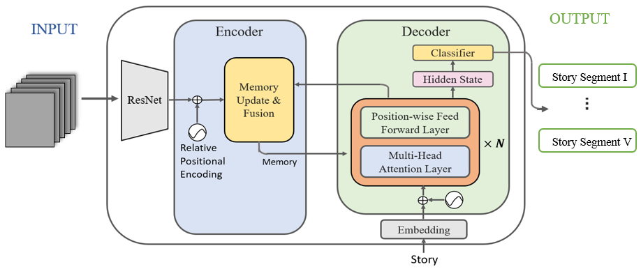

# TranstoryXL: Tell Stories from Image Streams

This repository provides codes to reproduce the work in [TranstoryXL: Tell Stories from Image Streams], which serves as course COMP0084 Statisitical Natural Language Processing's final project of Team 33: Junyu Mao, Tianji Liu, Jiaqi Wang, Hengjia Li (all contribute equally) at UCL. 



<br>


### Dependencies
Python 3.6 or 2.7<br>
[Pytorch](https://pytorch.org) >= 1.0.0

<br>

### Prerequisites

##### 1. Clone the repository to local
```
git clone https://github.com/junyumao1996/NLP_Project.git
cd NLP_Project
```

##### 2. Download requirements
```
pip3 install -r requirements.txt
```

##### 3. Download sentence tokenizer
```{.python}
python3
>>> import nltk
>>> nltk.download('punkt')
>>> exit()
```

<br>

### Preprocessing

##### 1. Download the dataset
[VIST homepage](http://visionandlanguage.net/VIST/dataset.html)

##### 2. Resize images and build vocabulary
All the images should be resized to 256x256.
```
python3 resize.py --image_dir [train_image_dir] --output_dir [output_train_dir]
python3 resize.py --image_dir [val_image_dir] --output_dir [output_val_dir]
python3 resize.py --image_dir [test_image_dir] --output_dir [output_test_dir]
python3 build_vocab.py
```

<br>

### Training & Validation

```
python3 train.py
```

<br>

### Evaluation

##### 1. Download the [evaluation tool (METEOR score)](https://github.com/windx0303/VIST-Challenge-NAACL-2018) for the VIST Challenge
```
git clone https://github.com/windx0303/VIST-Challenge-NAACL-2018 ../VIST-Challenge-NAACL-2018
```

##### 2. Install Java
```
sudo apt install default-jdk
```

##### 3. Run eval.py script
```
python3 eval.py --model_num [my_model_num]
```
The result.json file will be found in the root directory.

<br>

### Preparation for running the demo on Colab
1. Upload all the files in this repository to your google drive.
2. Upload ``test.zip`` to ``<project_root>/data``, ``test.story-in-sequence.json`` to ``<project_root>/data/sis`` (you may need to make a new directory).
3. Upload the saved Transtory-XL model to ``<project_root>/models``.
4. Modify the path in the third code block of the notebook to be your project root path. 

<br>


### License

MIT License<br>

